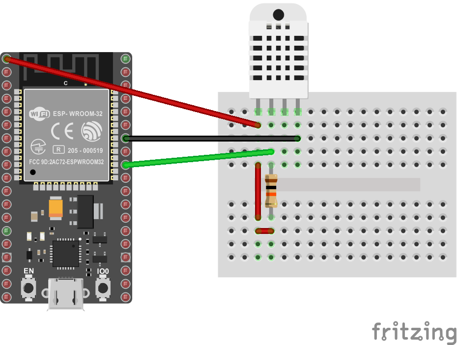

# Sample of sending periodical temperature sensor data from ESP32 with MQTT
Simple program for ESP32 SoC for reading data from temperature sensor and periodically sending them over MQTT to message queue broker. Project is used as sample hardware data producer in [IoT Dashboard guide](https://kyberpunk.github.io/iot-dashboard/).

## Overview
The first step for home automation is to measure temperature data. You can build real time applications which will control heating in your home or you can just collect data and process them for energy saving optimalizations. With this project you can build simple device using popular ESP32 which can periodically measure temperature and humidity and wirelessly send data to message broker.

ESP32 is cheap but powerfull controller with two 32 bit processor cores and embedded Wi-Fi and Bluetooth module. ESP32 has very nice [SDK](https://docs.espressif.com/projects/esp-idf/en/latest/), large community of developers and very good support. MQTT is widespread message queue protocol which is suitable for sending and consuming data or any events. It is lightweight enough to use in embedded applications. We will use [Mosquitto](https://mosquitto.org/) broker in this sample.

## Requirements
You will need following components to build this application:
* ESP32S-HiLetgo or any other ESP32 development board
* DHT22 or DHT11 integrated temperature and humidity sensor
* [Raspberry Pi](https://www.raspberrypi.org/) or any Linux device for MQTT broker
* Linux or Windows machine to compile sources

All components can be easily bought on Aliexpress for reasonable price.

## Implementation description
Application is implemented in C using [esp-idf](https://github.com/espressif/esp-idf) SDK. Code uses also third party sources [parson](https://github.com/kgabis/parson) for data serialization and [esp-idf-lib](https://github.com/UncleRus/esp-idf-lib) with various peripheral drivers.

Application connects to network with Wi-Fi. Real time is used to measurements time stamps an synchronization, so the application needs acces to NTP server. It can be deployed in local network for offline applications. Measurements are synchronized by real time to have measurements on multiple devices with the same time offset. DHT22 sensor is used by default for measurements with data I/O on pin `GPIO18`.

### Configuration
Configuration settings such as network settings or measurements periodicity can be set in [`main/config.h`](https://github.com/kyberpunk/esp-temperature-control/blob/master/main/config.h) or passed as compiler flags.

There is incomplete list of configuration macros:

Macro constant | Description
--- | ---
WIFI_SSID | Wi-Fi network SSID
WIFI_PASSWORD | Wi-Fi network password
GATEWAY_IP | IP address or hostname of MQTT broker
MQTT_MEASUREMENT_TOPIC | Name of the topic to which will be the measurements published
DEVICE_ID | Device specific identificator to distinguish between them
MEASUREMENT_INTERVAL | The length of period between measurements in ms
MEASUREMENT_OFFSET | Offset to measurement interval in ms calculated as: sample_utc_ms % MEASUREMENT_INTERVAL

### Using another sensor
It is also possible to use another temperature sensor with custom driver implementation. In this case you should use own implementation of [main/platform_measurement.h](https://github.com/kyberpunk/esp-temperature-control/blob/master/main/platform_measurement.h) header file.

## Temperature sensor wiring
There is sample wiring diagram how to connect DHT22 sensor to ESP32. In this example ESP32S HiLetgo development board is used. DHT22 `VCC` pin is connected directly to ESP board `VDD 3V3` voltage output. DHT22 `GND` pin is connected to any ground pin on ESP board. `DATA` pin is connected to `GPIO18` pin with 10kΩ pull up resistor. On specific ESP32 pin can be use also internal pull up resistor instead.



## Build
To be able to compile the source [esp-idf](https://github.com/espressif/esp-idf) SDK and ESP32 Toolchain must be installed. You can follow [official documentation](https://docs.espressif.com/projects/esp-idf/en/latest/get-started/) with concrete steps how to install it.

To build run:
```
idf.py build
```
To flash binary into the ESP32 run:
```
idf.py -p <port>
```
Instead of `<port>` use serial interface name which is connected to ESP chip (e.g. /dev/ttyS0). On some development board it necessary to push BOOT button or BOOT button and EN combination to start flash.

## Install MQTT broker
In this sample is used [Eclipse Mosquitto project](https://github.com/eclipse/mosquitto) as MQTT broker. It is is an open source implementation of a server for version 5.0, 3.1.1, and 3.1 of the MQTT protocol.

Fastest way is to use the [Docker image](https://hub.docker.com/_/eclipse-mosquitto). Or you can simply install it from Debian repository on Raspberry Pi or build it by your own from the [GitHub repository](https://github.com/eclipse/mosquitto).

## Run
Download and run docker image with Mosquitto:
```
docker pull eclipse-mosquitto
docker run -d -p 1883:1883 -p 9001:9001
```
Mosquitto is started with default configuration. MQTT port 1883 and Websockets 9001 are atached on the same host machine ports.

When MQTT broker is successfuly deployed you can power on the ESP32 device. Device should log successful MQTT connect event to the UART output.

## Data consumer
Mosquitto project provides also a client implementation which can be used for data reception test. Install it from repository:
```
sudo apt-get install mosquitto-clients
```
There is example of topic subscription command and received JSON message with temperature and humidity:
```
:~$ mosquitto_sub -h 127.0.0.1 -t sensor/temp
{
    "id": "SENSOR1",
    "temperature": 21.600000381469727,
    "humidity": 69.199996948242188,
    "utc": 1574285040011
}
{
    "id": "SENSOR1",
    "temperature": 21.600000381469727,
    "humidity": 69.199996948242188,
    "utc": 1574285100004
}
```
